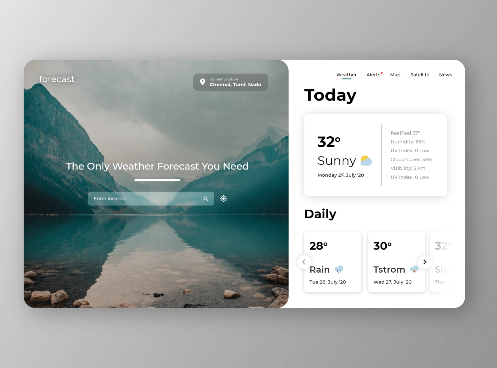

# WeatherForecastApp

### Task Description
Develop a weather forecast widget that dynamically displays weather information. The widget's functionality is based on the user's location, determined via IP address or manual entry, with support for autocomplete suggestions from a predefined list of cities. If a city is not found in the list, the app should query an external API for information and integrate the new city into the suggestions list. Additionally, the app must incorporate browser geolocation for precise weather updates.

#### Core Features:

- **Dynamic Weather Forecast Display**: Utilize user IP to automatically fetch and display the current weather forecast.
- **Cities Autocomplete**: Implement an autocomplete feature for location input, initially supported by a hardcoded list of cities.
- **Extended City Database**: Enable users to add new cities to the autocomplete suggestions by fetching missing city data from an external API.
- **Geolocation Support**: Incorporate browser API for geolocation detection to improve location accuracy.

#### Main Requirements:

- **Tailwind CSS**: Utilize Tailwind CSS for styling to promote utility-first principles and responsive design, ensuring a modern and efficient approach to UI development.
- **Component-Based Architecture**: Employ a component-based approach for scalable and maintainable code structure.
- **UI Fidelity**: Ensure the UI is developed according to provided design specifications, achieving pixel-perfect accuracy.
- **Responsive Design**: The app must offer an optimal viewing experience across mobile, tablet, and desktop devices.

#### Optional requirements:
- **Data Caching**: Implement caching mechanisms to optimize data retrieval and reduce API calls.
- **Angular Material**: Utilize Angular Material components for a cohesive and modern UI, if it can be applied anywhere.
- **Innovation**: Encourage creative solutions to enhance user engagement and app functionality beyond the basic requirements.

#### Recourses
- [WeatherForecast API Key registration](https://home.openweathermap.org/users/sign_up)
- https://openweathermap.org/forecast5
- https://openweathermap.org/current

IP Geolocation API:
- https://ipinfo.io/json
- https://ipwho.is/

Design:

This project was generated with [Angular CLI](https://github.com/angular/angular-cli) version 17.1.3.

#### Development server

Run `ng serve` for a dev server. Navigate to `http://localhost:4200/`. The application will automatically reload if you change any of the source files.

#### Code scaffolding

Run `ng generate component component-name` to generate a new component. You can also use `ng generate directive|pipe|service|class|guard|interface|enum|module`.

#### Build

Run `ng build` to build the project. The build artifacts will be stored in the `dist/` directory.

#### Running unit tests

Run `ng test` to execute the unit tests via [Karma](https://karma-runner.github.io).

#### Running end-to-end tests

Run `ng e2e` to execute the end-to-end tests via a platform of your choice. To use this command, you need to first add a package that implements end-to-end testing capabilities.
